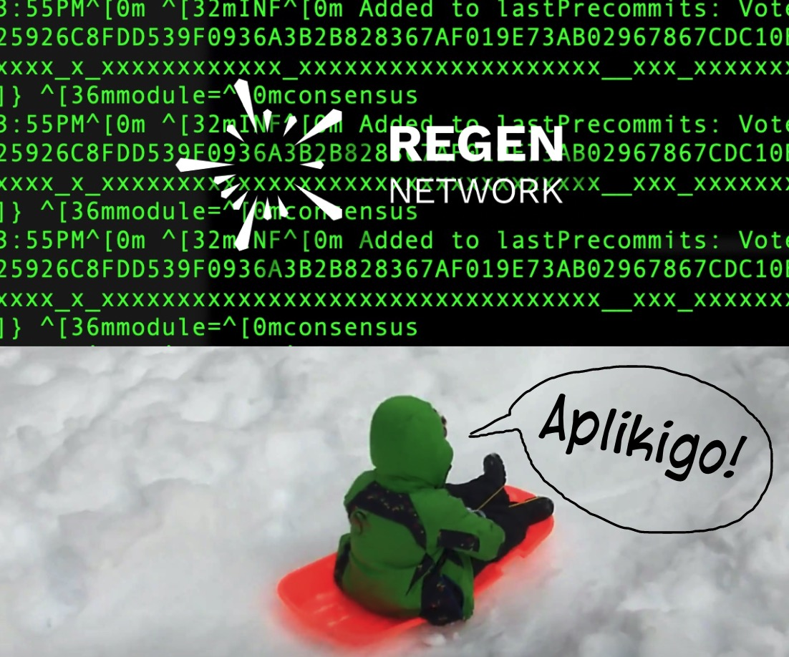

# Regen Utils
This small collection of utils can simplify common admin tasks to help orchestrate 
a new validator in support of the forthcoming Regen Network ledger. When nature 
hangs in the balance, there's not a moment to lose =)

For full context please be sure to checkout https://github.com/regen-network/testnets/ and https://blockscape-network.medium.com/here-we-aplikigo-bb468d242bc1 and then keep reading below.

# What's here
## Regen Service
Utils to install, uninstall, start, and stop

## Regen Logs
Utils to install and uninstall config files to rotate your validator logs via a 
crontab every so often. 

# Testing and Requirements
- These utils were tested on a fresh Ubuntu 20.04 server running on AWS 
- 200GB EBS volume with multi-attach support was mounted at /home for easy future upgrades 

# Getting Started
Clone this repo on your remote host and open a terminal. Next review and run the commands 
from `init-server.log` and run them as you see fit. After you are done, you'll have a 
fresh validator with regen binaries on your path. 

Install the regen service, 

1. `> bash regen-utils/install-regen.sh`

Install log rotation,

2. `> bash regen-utils/install-regen-logrotate.sh`

Start the service

3. `> bash regen-utils/start-regen.sh`

# Future Ideas
- add support for Chef 
- add support for Puppet
- add support for a K8 buildpack

"Discover Possible"
